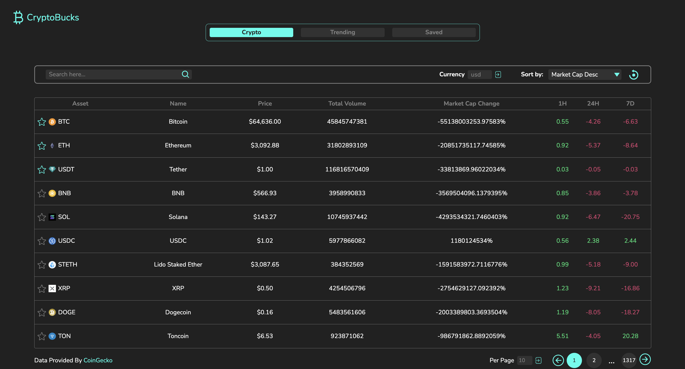
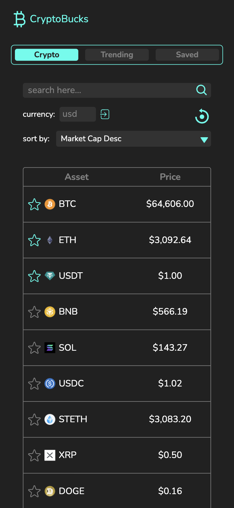
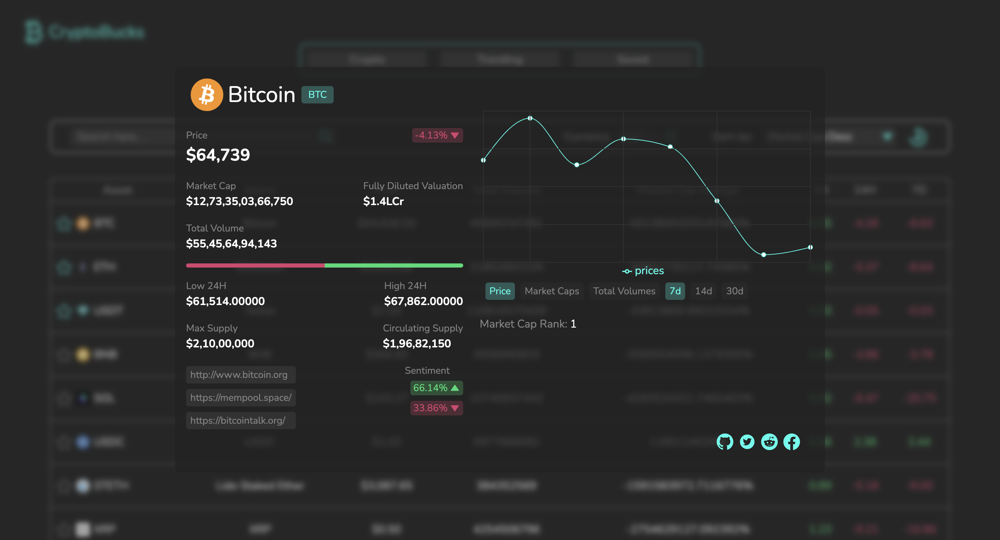
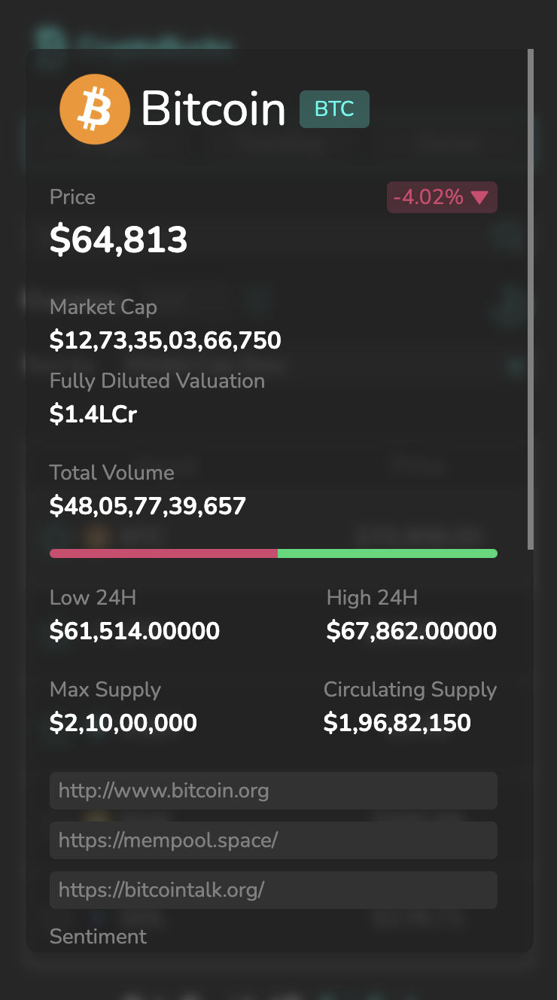
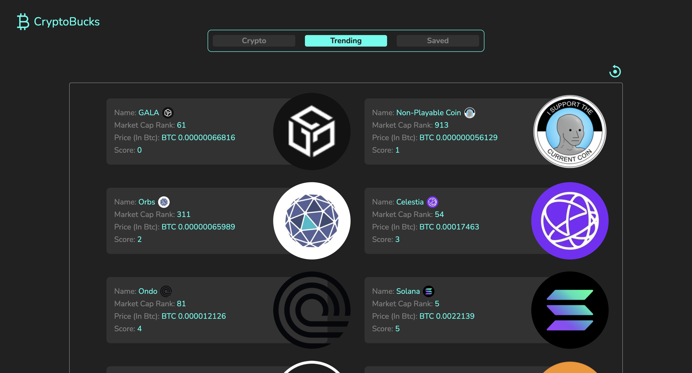
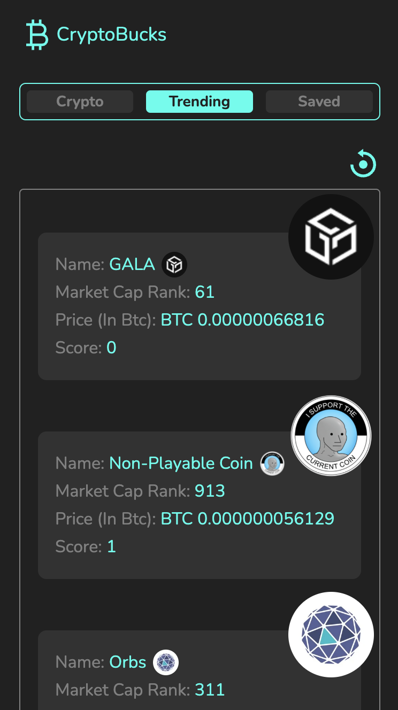
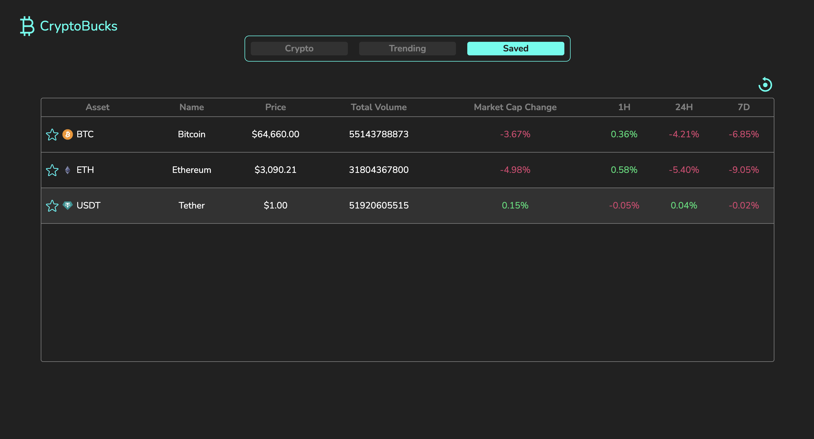

# CryptoBucks - A Crypto screener Application

 
 


This is a Crypto Screener website developed using React.js, Tailwind CSS, Context API for state management, React Router and Cryptocurrency APIs. The website allows users to view all cryptocurrencies see which one of them is trending in the market and save them for future.

## Prerequisites

Before you begin, ensure you have met the following requirements:

- Node.js and npm installed
- Clone this repository


## Installation

1. Clone the repository:
```bash
git clone git@github.com:ScaryWings83289/crypto-tracker.git
cd crypto-tracker
```

2. Install dependencies:
```bash
yarn install
```

3. Start the development server:
```bash
yarn dev
```

4. Access the website by navigating to http://localhost:5173/ in your web browser.


## Usage 
The website allows users to:

- **Browsing Catalog:** Navigate through the catalog to explore various cryptocurrencies and their market caps.
- **Latest Trends:** Keep track of the latest trends for individual crypto coins to make informed decisions.
- **Trending Coins:** Discover trending coins in the crypto market to stay ahead.
- **Favorites:** Save your favorite coins for quick access and future reference.


## Features
CryptoBucks is a web application that offers the following features:

- Browse a catalog of cryptocurrencies along with their respective market caps.
- Stay updated with the latest trends of individual crypto coins.
- Explore trending coins in the crypto market.
- Save favorite coins for future reference.

**SCREENSHOTS:**

Crypto Listing Page:





Crypto Details Page:





Trending Page:





Saved Crypto Page




## Developed With

* [Visual Studio Code](https://code.visualstudio.com/) - A source code editor developed by Microsoft for Windows, Linux and macOS. It includes support for debugging, embedded Git control, syntax highlighting, intelligent code completion, snippets, and code refactoring
* [React](https://reactjs.org/) - A javascript library for building user interfaces
* [Vite](https://vitejs.dev/) - It is a new breed of frontend build tooling that significantly improves the frontend development experience.
* [Tailwind CSS](https://tailwindcss.com/) - It is a utility-first CSS framework for rapidly building modern websites without ever leaving your HTML.
* [CoinGecko API](https://www.coingecko.com/api/documentation) - CoinGecko provides a fundamental analysis of the crypto market. In addition to tracking price, volume and market capitalisation, CoinGecko tracks community growth, open-source code development, major events and on-chain metrics.

